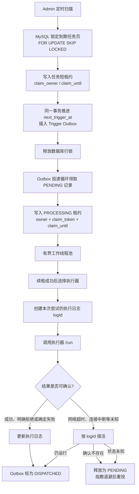
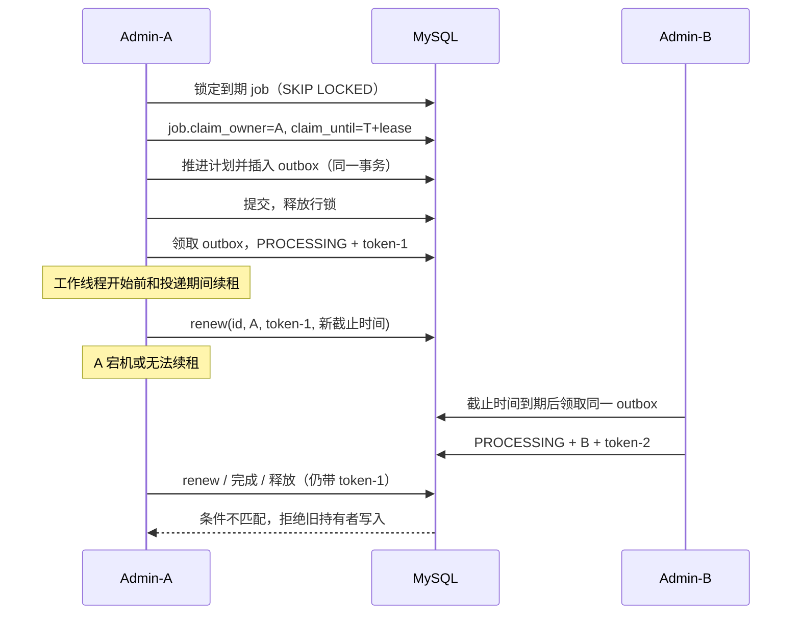
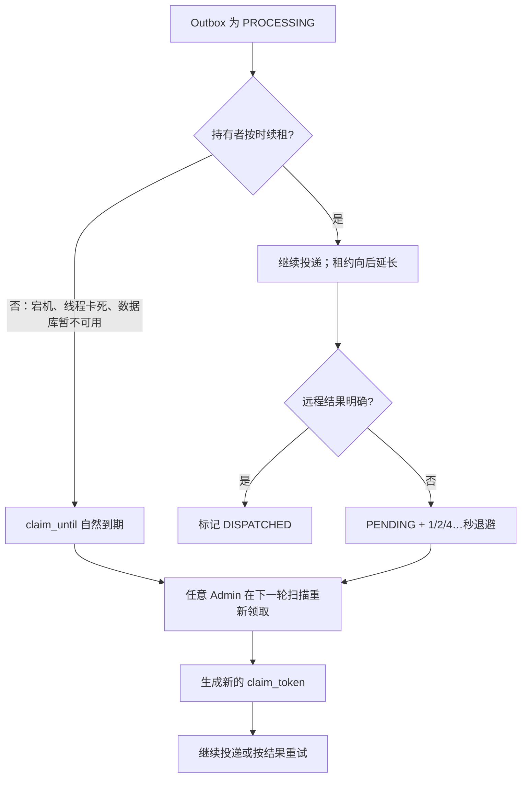
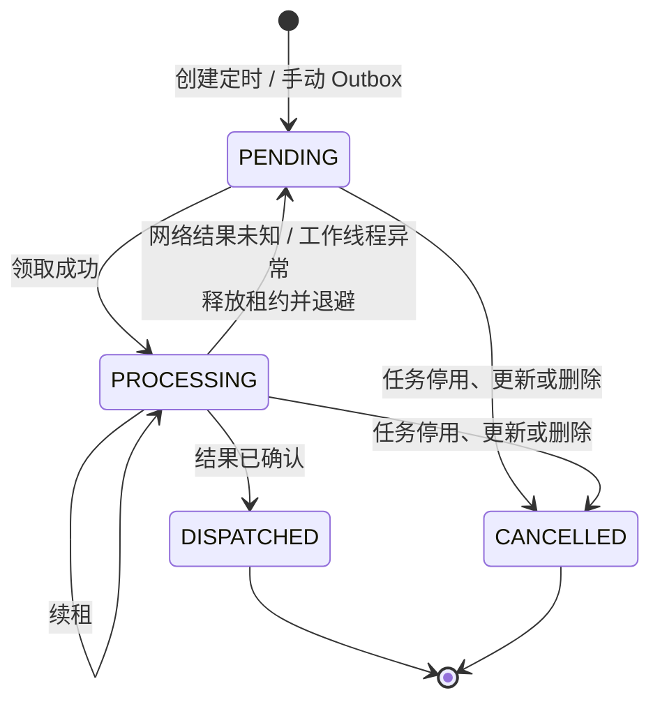
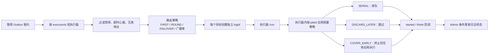
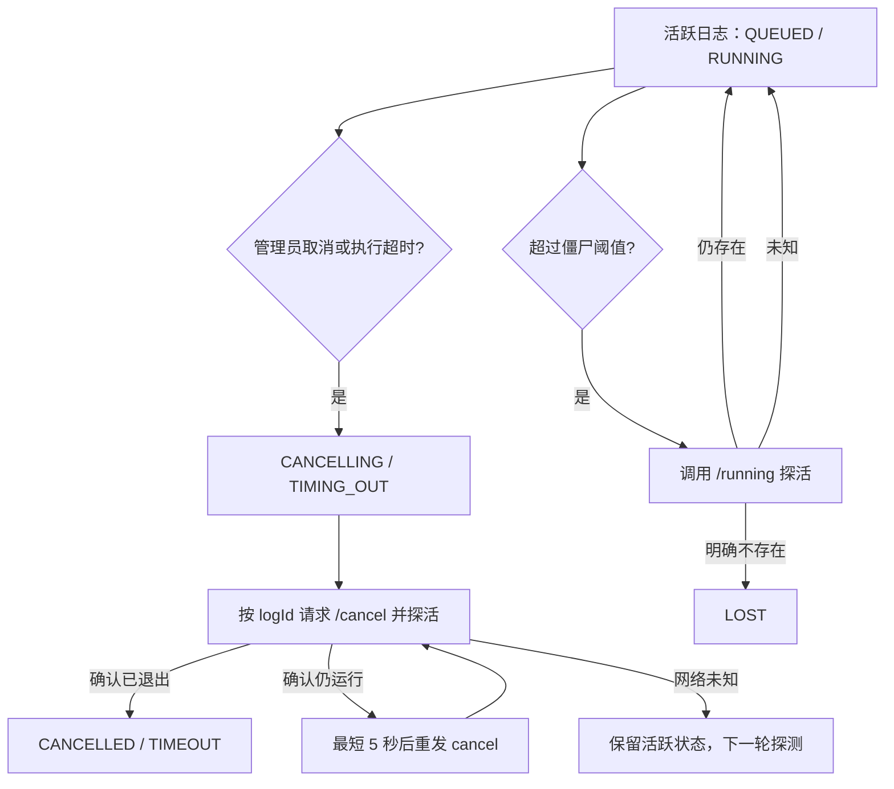
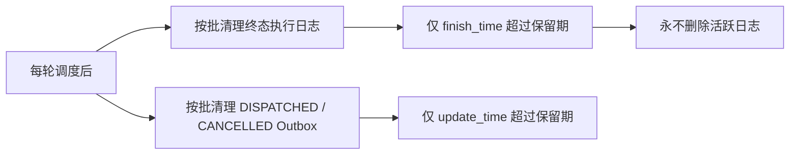

# 调度执行与租约流程

本文说明当前 `infra-schedule` 从定时扫描到执行完成、异常恢复和日志清理的实际运行链路。调度状态以 MySQL 为唯一事实来源；Admin 节点可以水平扩容，执行器不直接访问调度数据库。

## 1. 一次定时触发的全链路



任务扫描与执行器调用分离：扫描事务只领取并生成 Outbox，不等待网络调用或 Handler 完成。因此慢执行器、网络超时和单个任务堆积不会持有 MySQL 行锁，也不会阻塞其他任务的扫描。

## 2. 两层租约分别解决什么问题

| 层级 | 记录 | 用途 | 关键字段 |
| --- | --- | --- | --- |
| 定时任务领取租约 | `infra_schedule_job` | 多个 Admin 只允许一个节点推进同一次定时计划 | `claim_owner`、`claim_until` |
| Outbox 投递租约 | `infra_schedule_trigger_outbox` | 多个 Admin 只允许一个节点在某一时刻投递同一条触发记录 | `claim_owner`、`claim_token`、`claim_until` |

任务租约只覆盖“计算下次时间 + 生成 Outbox”的短事务。Outbox 租约覆盖异步投递全过程；它在工作线程启动前、每次发起远程调用前和后台定期任务中续租。两层分开后，长时间执行不会阻塞任务定义表。



## 3. 租约的工作原理

### 3.1 为什么不是一直持有数据库锁

`FOR UPDATE SKIP LOCKED` 只在领取事务中使用：已被其他节点锁住的记录会跳过，而不是排队等待。事务提交后，数据库锁立刻释放；后续由字段中的“逻辑租约”表达所有权。这样能够并行扫描，又避免网络调用期间长期锁表。

### 3.2 为什么需要 owner 和 token

`claim_owner` 标识当前进程；其值包含 `scheduler-id` 和每次进程启动新生成的随机 UUID，避免进程重启后旧进程与新进程拥有相同身份。

Outbox 还额外使用每次领取都变化的 `claim_token`。所有关键写入（续租、标记已投递、释放重试、创建受保护的执行日志）都要求同时匹配：

```text
status = PROCESSING
AND claim_owner = 当前进程 owner
AND claim_token = 本次领取 token
AND claim_until > 当前时间
```

这是一种 fencing（隔离令牌）机制。即使 Admin-A 因 GC、网络分区或停顿错过租约，Admin-B 已接管记录，Admin-A 恢复后也无法把 B 的新状态覆盖回去，更不能在续租检查失败后继续发起新的远程调用。

### 3.3 租约到期后的恢复



因此租约不会“解锁”正在运行的远端 Handler；它只允许其他 Admin 恢复**调度记录**。若旧节点已把 `/run` 请求送达、但在收到响应前宕机，恢复节点可能再次投递。这是可靠投递的正常边界：系统提供至少一次（at-least-once）投递，而不是端到端 exactly-once。

业务 Handler 必须使用业务键、触发时间或自身幂等键消除重复副作用，并正确响应线程中断。

## 4. 状态转换



`PENDING.claim_until` 表示“最早可再次领取时间”；`PROCESSING.claim_until` 才表示“租约失效时间”。复用该字段使退避不需要额外表或定时器。

任务停用或编辑会取消未开始的定时 Outbox；任务删除会额外取消手动 Outbox。已经提交到执行器的调用不会被误认为没有发生，而是继续通过执行日志的取消与探活链路处理。

## 5. 执行器路由、阻塞与日志



一条 Outbox 在网络未知后重新投递时，每次远程尝试都会建立独立 `logId`。这避免旧尝试迟到的 `finish`、`cancel` 或 `/running` 回答覆盖新尝试。执行器侧阻塞策略的作用范围是“同一执行器进程中的同一 `jobId`”；多个执行器地址仍可能并行执行。

## 6. 超时、取消和僵尸日志



僵尸回收从不因“请求失败”直接标记 `LOST`：只有执行器明确回答该 `logId` 不存在时才会收口。网络错误、鉴权错误、5xx 和协议异常均视为未知，以免仍在运行的远端任务从管理端视野消失。探活使用有界并发和主键游标分页，避免大量失联执行器拖慢正常调度。

## 7. 清理与可观测性



清理操作有批量上限，避免长事务和锁竞争；活跃日志、任务定义以及仍待处理的 Outbox 不属于清理范围。生产环境应至少监控 Outbox `PENDING/PROCESSING` 积压、租约续约失败、执行器心跳、`LOST/TIMEOUT` 数量、回调失败和清理失败。

## 8. 需要牢记的保证与边界

- MySQL 行锁保证同一时刻的领取互斥；租约保证节点宕机后记录可恢复。
- owner + token + 未过期条件防止失去租约的旧节点覆盖新持有者的状态。
- Outbox 让“推进下次计划”和“创建待投递记录”原子提交，避免计划已推进但触发丢失。
- 网络响应丢失时可能重复投递；业务必须幂等，系统不能替业务实现全链路 exactly-once。
- 租约和取消不能强制杀死不响应中断的远端业务线程；它们保证可追踪、可重试和不会永久阻塞调度。
